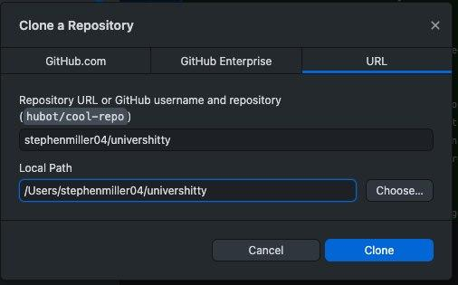
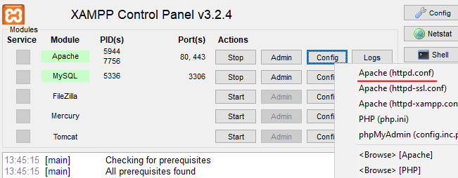

# Zack's Univershitty
Welcum bois and gals. Szóval kapni fogtok tőlem egy alapvető ~~picsánrúgást~~ tudást amivel elindulhattok a webfejlesztői szakmán.

## Amire szükséged lesz
- Kettes szintű "faszomkivan" feel a jelenlegi szakmáddal
- Egy Linux/MacOS/Winfos gép
- ~~Mardosó depresszió~~ Minimális életkedv
- [Github Desktop alkalmazás](https://desktop.github.com)
- [Visual Studio Code](https://code.visualstudio.com/download)
- [XAMPP](https://www.apachefriends.org/download.html)
- [Google Chrome](https://www.google.com/chrome/)

## Szépen fogsz és felraksz mindent
Ezután a Github appal leklónozod ezt a repot a gépedre:

Ajánlom a következő útvonalat: __C:/Files/Git/univershitty__

Miután megvagy, nyisd meg a XAMPP-ot, konfigolni fogunk egy kicsit.

<br>Majd kikeresed a `DocumentRoot` részt és beírod ezen mappa elérését:
```
DocumentRoot "C:/Files/Git/univershitty
<Directory "C:/Files/Git/univershitty">
```

Ha megvagy, az __Actions__ rész alatt Stop/Start gombbal indítsd újra az Apache modult.

Ezután nyisd meg a Chrome-ot, és a böngésző címsorába írj be ennyit: `localhost` csapj egy entert és ezt kell látnod:
*böngészőkép.jpg*

## 1. Fájlok és mappa szerkezet

## 2. HTML/CSS

## 3. Git

## 4. JavaScript

## 5. Alapvető programozás/PHP

## 6. SQL

## 7. Egy alapvető blog összerakása

## 8. Tesztelési folyamat